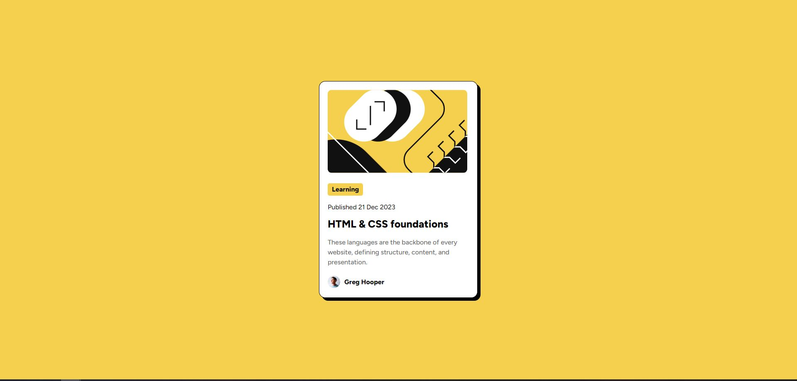

# Frontend Mentor - Blog preview card solution

This is a solution to the [Blog preview card challenge on Frontend Mentor](https://www.frontendmentor.io/challenges/blog-preview-card-ckPaj01IcS). Frontend Mentor challenges help you improve your coding skills by building realistic projects.

## Table of contents

- [Overview](#overview)
  - [The challenge](#the-challenge)
  - [Screenshot](#screenshot)
- [My process](#my-process)
  - [Built with](#built-with)
  - [What I learned](#what-i-learned)
- [Author](#author)

## Overview

### The challenge

Users should be able to:

- See hover and focus states for all interactive elements on the page

### Screenshot

## My process

### Built with

- HTML
- CSS
- Flexbox

### What I learned

Similarly to the [first Frontend Mentor challenge](https://github.com/filipangel/qr-code-component) I solved, the design is pretty simple. Completing this challenge served as proof that I've learned something from the Codecademy HTML and CSS fundamentals courses I finished. At this point I don't understand responsive design but luckily for me this challenge does not differ much between desktop and mobile designs. In the future I hope to learn responsive design and start building mobile-first.

## Author

- Frontend Mentor - [@filipangel](https://www.frontendmentor.io/profile/filipangel)
